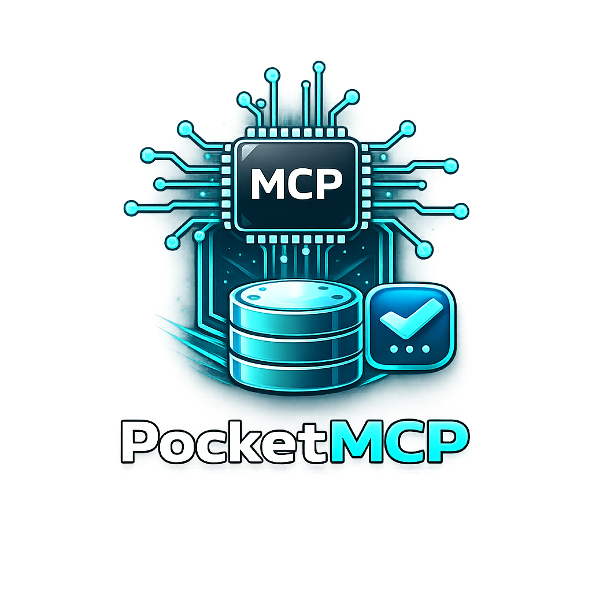

# PocketMCP CLI

<p align="center">
  
</p>

CLI para correr un servidor MCP sobre `stdio` para PocketBase y para instalar/desinstalar su configuracion en clientes MCP. Tambien encaja de forma natural en OpenCode y otros clientes MCP que consumen un comando local.

## Instalacion (binario precompilado)

Los instaladores publicos son solo estos dos:

- Linux/macOS: `install.sh`
- Windows: `install.ps1`

Nombres finales de binario instalado:

- Linux/macOS: `pocketmcp`
- Windows: `pocketmcp.exe`

Assets publicados en cada release:

- Linux: `pocketmcp`
- macOS: `pocketmcp-macos`
- Windows: `pocketmcp.exe`

### 1) Instalar ultima version disponible (latest)

```bash
curl -fsSL https://raw.githubusercontent.com/mreyeswilson/pocketmcp/main/install.sh | bash
```

```powershell
powershell -c "irm https://raw.githubusercontent.com/mreyeswilson/pocketmcp/main/install.ps1 | iex"
```

### 2) Fijar version manual (opcional)

Si necesitas una version puntual, define `VERSION` antes de ejecutar el instalador.
Tambien se mantiene compatibilidad con `MCP_PB_VERSION`.

```bash
curl -fsSL https://raw.githubusercontent.com/mreyeswilson/pocketmcp/main/install.sh | VERSION=v0.0.4 bash
```

```powershell
$env:VERSION = "v0.0.4"; powershell -c "irm https://raw.githubusercontent.com/mreyeswilson/pocketmcp/main/install.ps1 | iex"
```

Opcionalmente, en Windows tambien puedes invocar el script local con parametro:

```powershell
.\install.ps1 -Version v0.0.4
```

## Opciones de instalacion/configuracion MCP

Despues de instalar el binario final, estas son las opciones accionables para conectarlo en clientes MCP:

### 1) Clientes con instalacion automatica

Usa `pocketmcp install` para escribir la configuracion generada en `Claude Desktop`, `Cursor`, `VS Code` o `Windsurf`.

```bash
pocketmcp install --client all --url http://127.0.0.1:8090 --email admin@example.com --password 'tu_password'
```

### 2) OpenCode

Si usas OpenCode, configuralo con el binario final y `serve` + argumentos, igual que cualquier otro cliente MCP basado en comando local:

```json
{
  "command": "pocketmcp",
  "args": [
    "serve",
    "--url",
    "http://127.0.0.1:8090",
    "--email",
    "admin@example.com",
    "--password",
    "tu_password"
  ]
}
```

En Windows, usa `pocketmcp.exe` como comando.

## Uso rapido

1. Levanta el servidor MCP con el binario final y el subcomando `serve`:

```bash
pocketmcp serve --url http://127.0.0.1:8090 --email admin@example.com --password 'tu_password'
```

En Windows, el ejecutable instalado es `pocketmcp.exe`.

```powershell
pocketmcp.exe serve --url http://127.0.0.1:8090 --email admin@example.com --password "tu_password"
```

2. Instala configuracion MCP generada en clientes compatibles:

```bash
pocketmcp install --client all --url http://127.0.0.1:8090 --email admin@example.com --password 'tu_password'
```

3. Desinstala configuracion MCP:

```bash
pocketmcp install --uninstall --client all
```

## Flags principales

### `serve`

- `--url`
- `--email` (alias: `--user`)
- `--password`
- `--timeout-ms` (opcional, default `15000`)

Fallback por variables de entorno:

- `POCKETBASE_URL`
- `POCKETBASE_EMAIL`
- `POCKETBASE_PASSWORD`
- `REQUEST_TIMEOUT_MS`

### `install`

- `--client <all|claude-desktop|cursor|vscode|windsurf>`
- `--uninstall`
- `--binary <ruta>` (opcional, fuerza binario especifico)
- `--url`, `--email`/`--user`, `--password`, `--timeout-ms`

Notas:

- En modo instalacion, `url/email/password` son obligatorios (flags o env).
- En modo uninstall no hacen falta credenciales.
- El password se enmascara en logs.

## Requisitos (desarrollo)

- Deno 2.x
- Instancia de PocketBase accesible por URL
- Credenciales de admin/superuser

## Comandos de desarrollo

Estas instrucciones son solo para desarrollo interno del repo. El uso final para usuarios es siempre con el binario `pocketmcp`/`pocketmcp.exe` y el subcomando `serve`.

```bash
deno run -A src/cli.ts --help
deno task dev
deno task start
deno task install -- --help
deno task check
```

## Compilar a binario

```bash
deno compile --allow-env --allow-net --allow-read --allow-write --output ./dist/pocketmcp src/cli.ts
```

## Releases en GitHub Actions

Al pushear un tag `v*` (por ejemplo `v0.2.0`) se ejecuta `.github/workflows/release.yml` para:

- Compilar binarios para Linux, macOS y Windows
- Publicar exactamente estos assets finales: `pocketmcp`, `pocketmcp-macos`, `pocketmcp.exe`

## Landing docs

La landing esta en `docs/index.html` y se publica con `.github/workflows/pages.yml`.
